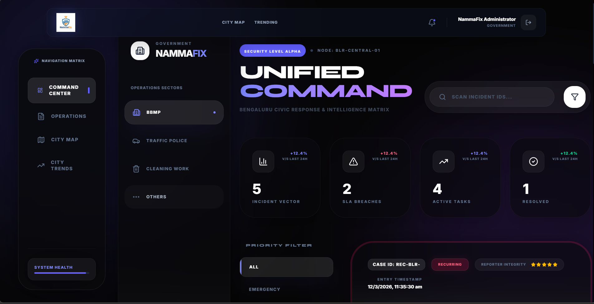
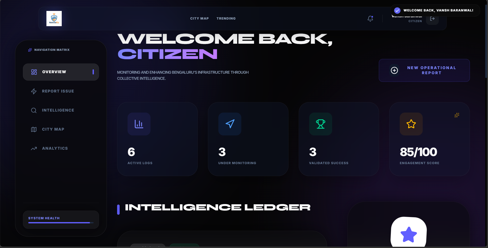
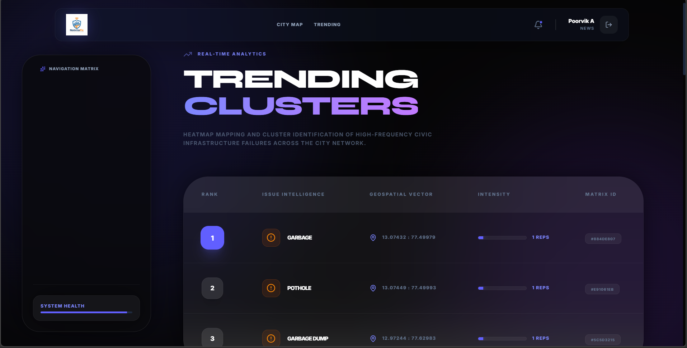

# 📍 NammaFix  
### AI Civic Intelligence Platform for Smarter Cities

---

# 🌆 About NammaFix

**NammaFix** is an **AI-powered civic grievance platform** designed to improve how cities detect, report, and resolve infrastructure problems.

Citizens can easily report issues like:

- 🕳️ Potholes  
- 🗑️ Garbage overflow  
- 💡 Streetlight failures  
- 🌊 Flooding  
- 🚰 Water leaks  

The platform uses **AI + geospatial intelligence** to:

- Automatically categorize issues
- Assign priority levels
- Detect clusters of problems
- Provide dashboards for government authorities and media

NammaFix creates a **collaborative ecosystem between citizens, government, and media** to build smarter cities.

---

# 🎥 MVP Link
https://build-for-bengaluru.vercel.app/

🚀 **Live Backend API**

https://build-for-bengaluru.onrender.com

Example endpoint:

https://build-for-bengaluru.onrender.com/api/heatmap

---

# 👥 Platform Roles

NammaFix supports **three user roles**.

| Role | Purpose |
|-----|------|
👤 Citizen | Report and track civic issues |
🏛 Government | Manage complaints and city operations |
📰 News | Analyze civic trends and transparency |

Each role has a **dedicated dashboard**.

---

# 👤 Citizen Dashboard

Citizens can easily report and track civic problems.

### Features

- Report civic issues  
- Track complaint status  
- View city-wide issue map  
- See trending problems  

### Pages

- Dashboard
- Report Issue
- Track Complaint
- City Map
- Trending Issues

### Screenshots

---

# 🏛 Government Dashboard

Acts as a **Smart City Control Center**.

Authorities can monitor issues and resolve them efficiently.

### Features

- City statistics dashboard  
- Complaint management system  
- Real-time issue map  
- Heatmap of civic problems  

Authorities can update complaint status:

Pending → In Progress → Resolved

---

# 📰 News Dashboard

Provides **data transparency and civic analytics**.

Media organizations can:

- Analyze issue trends  
- Visualize complaint hotspots  
- Track city infrastructure problems  

This helps ensure **public accountability**.

---

# 🗺 City Intelligence Map

The platform includes a **geospatial visualization system**.

Using **PostGIS**, we can:

- Detect complaints within 100m
- Cluster similar issues
- Generate city heatmaps

Issue markers:

| Issue | Color |
|-----|-----|
Pothole | Red |
Garbage | Orange |
Flooding | Blue |
Drainage | Purple |
Streetlight | Yellow |

---

# 🤖 AI Powered Complaint Analysis

When a complaint is submitted:

1️⃣ The description is sent to the AI service  
2️⃣ AI extracts:

- Issue category
- Severity
- Responsible department

Example AI output:

{
  "category": "pothole",
  "severity": "high",
  "department": "Roads and Infrastructure"
}

The system then assigns **priority automatically**.

---

# 🧠 Smart Duplicate Detection

Using **PostGIS spatial queries**, NammaFix detects duplicate issues.

If multiple complaints occur within:

100 meters

they are grouped into **clusters**.

This helps authorities quickly detect **problem hotspots**.

---

# ⚙️ Tech Stack

### Frontend

- React
- Tailwind CSS
- React Router
- React Leaflet
- Leaflet Heatmap
- Lucide Icons

### Backend

- Node.js
- Express.js
- REST APIs

### Database

- PostgreSQL
- Supabase
- PostGIS

### AI

- Groq API
- LLM-powered complaint analysis

### Deployment

Frontend → Vercel  
Backend → Render  
Database → Supabase  

---
### Architecture

Build-For-Bengaluru/
│
├── backend/
│   ├── src/
│   │   ├── config/
│   │   │   └── env.js
│   │   │
│   │   ├── controllers/
│   │   │   └── complaintController.js
│   │   │
│   │   ├── database/
│   │   │   └── db.js
│   │   │
│   │   ├── middlewares/
│   │   │   ├── validator.js
│   │   │   ├── rateLimiter.js
│   │   │   └── errorHandler.js
│   │   │
│   │   ├── routes/
│   │   │   └── complaintRoutes.js
│   │   │
│   │   ├── services/
│   │   │   └── aiService.js
│   │   │
│   │   ├── utils/
│   │   │   └── geoUtils.js
│   │   │
│   │   └── server.js
│   │
│   ├── package.json
│   └── .env
│
├── frontend/
│   ├── src/
│   │   ├── components/
│   │   │   ├── Navbar.jsx
│   │   │   ├── Sidebar.jsx
│   │   │   ├── Layout.jsx
│   │   │   ├── StatCard.jsx
│   │   │   └── LoadingSpinner.jsx
│   │   │
│   │   ├── pages/
│   │   │   ├── Dashboard.jsx
│   │   │   ├── ReportIssue.jsx
│   │   │   ├── TrackComplaint.jsx
│   │   │   ├── CityMap.jsx
│   │   │   └── TrendingIssues.jsx
│   │   │
│   │   ├── services/
│   │   │   └── api.js
│   │   │
│   │   ├── App.jsx
│   │   └── main.jsx
│   │
│   ├── package.json
│   └── vite.config.js
│
└── README.md

# 🏗 System Architecture

Citizen / Government / News  
↓  
React Frontend  
↓  
Node.js API  
↓  
AI Complaint Analysis  
↓  
PostgreSQL + PostGIS Database  
↓  
Geospatial Queries  

---

# 📡 API Endpoints

| Endpoint | Method | Purpose |
|--------|-------|-------|
/api/complaints | POST | Submit complaint |
/api/complaints/:id | GET | Track complaint |
/api/complaints/:id/status | PATCH | Update status |
/api/trending | GET | Trending issues |
/api/heatmap | GET | Map data |

---

# 🔐 Privacy & Security

NammaFix ensures **citizen privacy**.

The system:

- Does not expose user identity
- Only returns complaint data
- Protects personal information

---

# 📊 Key Features

- AI-powered complaint classification  
- Smart duplicate detection  
- Geospatial heatmaps  
- Role-based dashboards  
- Transparent civic analytics  

---

# 🌍 Real World Impact

NammaFix helps cities:

- Detect infrastructure issues faster  
- Improve government response time  
- Enable transparent civic reporting  
- Empower citizens to participate in governance  

---

# 🚀 Future Improvements

- Mobile app integration
- Real-time notifications
- Government department routing
- Predictive civic analytics

---

# 👨‍💻 Team

Team **VegaSync**

Built for **Build for Bengaluru Hackathon**

---

# ❤️ Built for Smarter Cities

NammaFix transforms how urban problems are detected, tracked, and solved.

Together we can build **smarter and more responsive cities**.

---

⭐ If you like this project, give it a **star on GitHub!**
